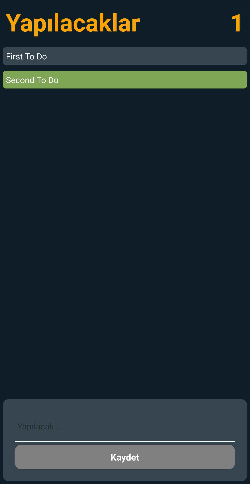

# To Do List with React Native

## Project Technical Information

- React Native

## Setup

React Native: [Setting up the development environment](https://reactnative.dev/docs/environment-setup)

## How to Run the Project

```
git clone https://github.com/oguzcanuzunoner/reactNative-toDoList.git
```

## Usage

To use it after cloning the project:

```
cd todo
cd .
```

Run the following commands in the project folder to install the project dependencies.

```
npm init
npm install
```

## Available Scripts

In the project directory you can run:

```
npx react-native run-android
```

Or

```
npx react-native run-ios
```

<br>

## Screen Shot

<p align="center">
  
</p>

<p align="center">
  
</p>

<p align="center">
  
</p>

## Developer

---

[Oğuzcan Uzunöner](https://github.com/oguzcanuzunoner)

## Licence

---

[MIT](https://choosealicense.com/licenses/mit/)
